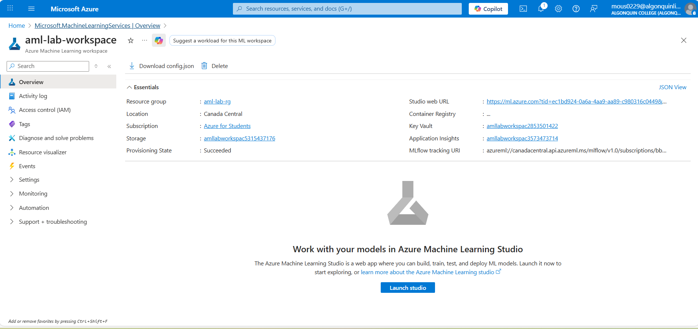
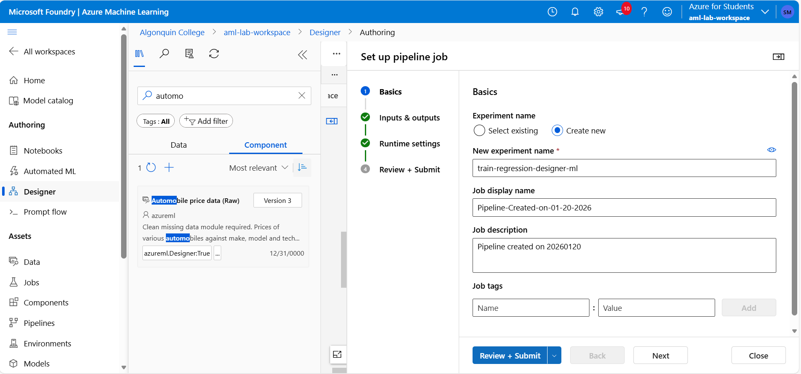
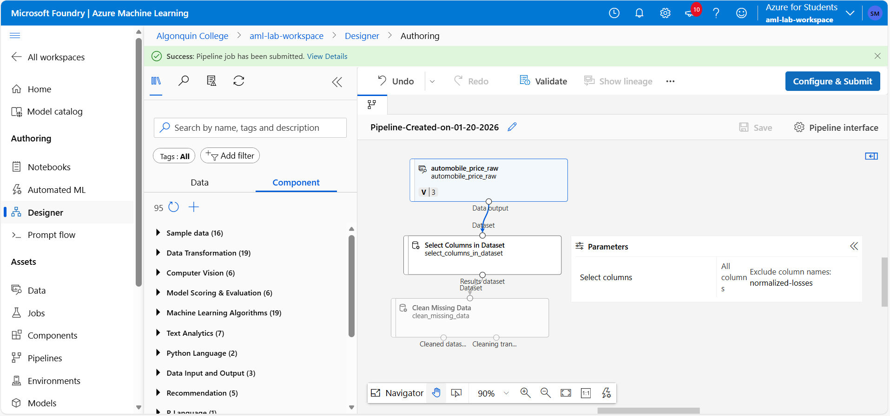
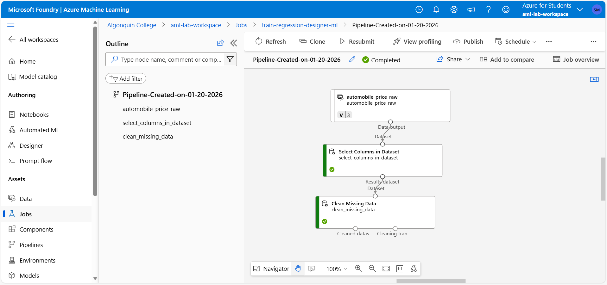

# LAB 1 - AI and ML

## 1. Create Azure Machine Learning

## 2. Azure Machine Learning Studio

## 3. Create a Training Pipeline

## 4. Create a New Experiment

## 5. Create Compute Instance

# 6. Pipeline Created Successfully

# 7. Job Successful

